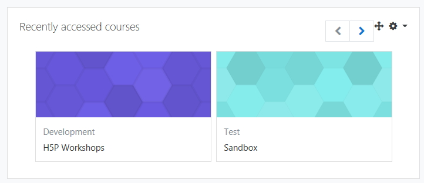

## Moodle Sandbox

In order to complete these workshops you will have to work from a training area in Moodle,we call this a sandbox, please contact <a href="mailto:cponeill@wit.ie">Conor O'Neill</a> to gain access.

Log into Moodle <a href="http://moodle.wit.ie" target="_blank">here</a>  and navigate to your sandbox.

## The Module Image

Your Moodle module when created will have a default image, you can change the image in the Module settings

## Change the Image

The image that your going to change is the image that is associated as the default image for the module when the module is first created, see below and example of a default image.

## Edit Settings

To change the image you first need to **turn editing on** from the settings for the module.

## Drag and Drop

To change the image drag and drop your image into the "summary files" space, you can use any image that you have, I just upload a **.jpg** file I had in my downloads folder.

## Save your changes

Like all changes in Moodle you need to make sure you save your changes

Your done,  ***Move to the next step***.

