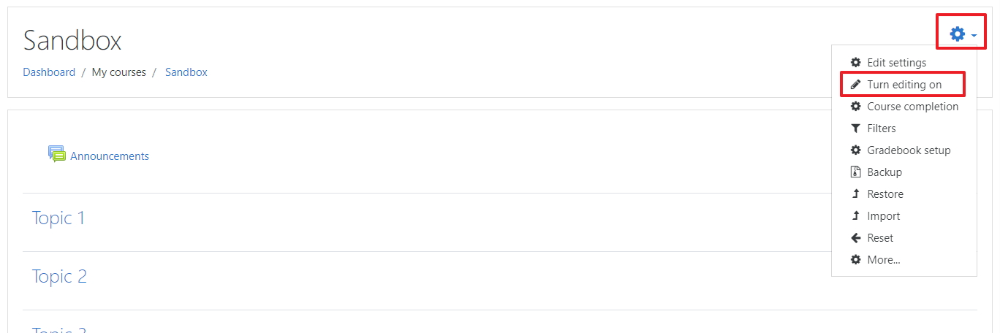
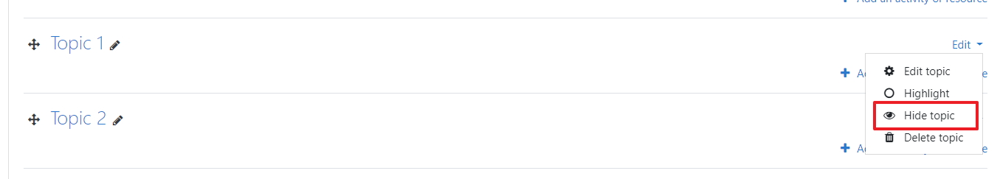
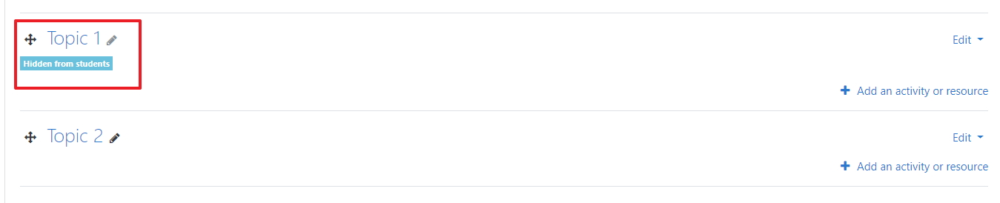

# The Module Sections

Your Moodle module when created will have a default sections, in this step you wil learn how and why you should close off blank (unuesed) sections.

## Edit Settings

To hide blank section you first need to **turn editing on** for the module

## Edit the section

Its important to hide a section because if the section is blank and is not hidden the student have visibility and it causes confusion for the student, click on edit then click on Hide section

Repeat this process with all blank sections

When you finished and you have turned editing off your hidden section should now have a message saying the topic is hidden from students

Your done,  ***Move to the next step***.