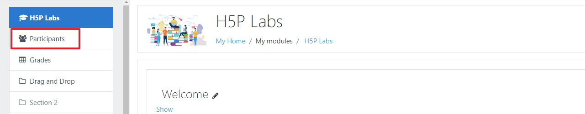
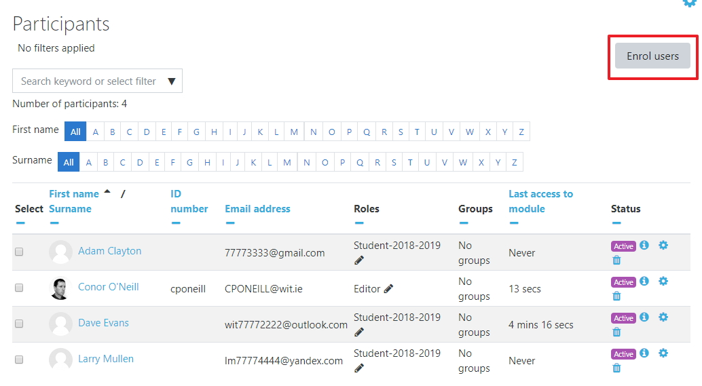
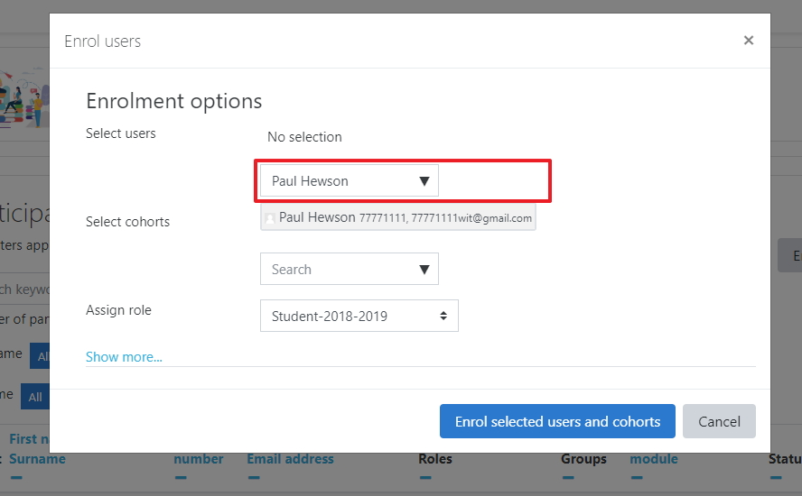
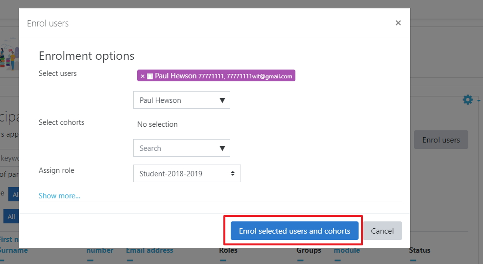

# The Module Participants

Normally your student (participants) will appear in your module, from time to time you may want to view the participant list to look up either the student email or their last access.

## Participants option

To view the participants of a module click on the Participant on the left hand side of the screen.

## Participants list

You now should be able to see the participants list along with other details such as they email address and when they last logged into this module.

## Adding Participants

To add a participant click on the Enrol users button

Then search for the user that you want to add

When you find that user click on the name then click the Enrol button at the bottom of the popup screen

You have manually add a participant and if you look at the participants list once again you should see that user in the list.

Your done,  ***Move to the next step***.
