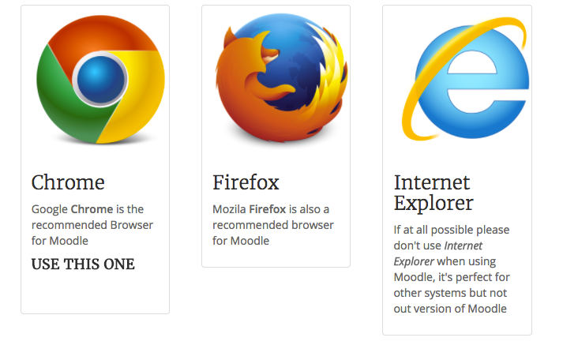
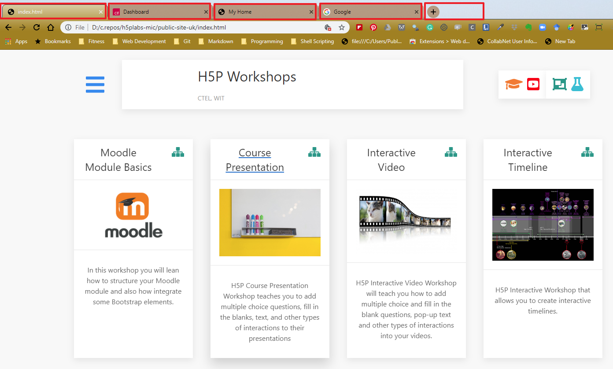

#Lets get started
 
The following workshop is practical by nature, it uses a series of steps to guide you through tasks that will help you developer an understanding of how to integrate Bootstrap into your modules in Moodle.

##Browsers

Moodle like Google Chrome and Firefox - Things might not look right if you use Internet Explorer

##Browser Tabs

We will be using multiple tabs during these steps, for instance a Moodle Tab, a Search Tab etc

