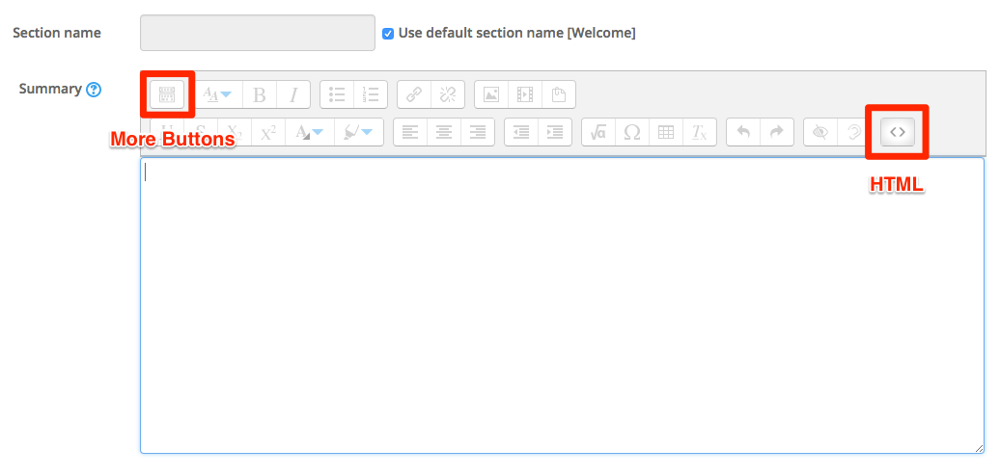

#Jumbotron

The Bootstrap Jumbotron is a welcome message, it is normally used at the top of a webpage and in your Moodle module the welcome section is a good area to use the Jumbotron component  

 

##Moodle Integration

Okay, so that's what a jumbotron looks like, how do I get this into my module in Moodle?

##In your Moodle module

In your moodle module or training area (commonly know as a sandbox) *turn editing on* then navigate to your welcome section and click *edit section*

 

When you get to the next screen you will see the option to click more more buttons and also the button to insert the HTML code, click these buttons now and you should see the following screen.

 

##Copy and Paste

Copy and Paste the code below into the window and click the HTML code button, now you should see the result of the rendered code.

~~~HTML

  <h1>Hello, world!</h1>
  
...

  
<a class="btn btn-primary btn-lg" href="#" role="button">Learn more</a>

~~~

When you click the HTML code button you should see the following screen

*Note:* you can change this code in this window, so for instance you can change the text that appears as the message along with the heading, it might look something below, change this now and save your work.

##What's behind the button?

Let leave this for fir now, we will return to this later.

Continue to - [Step 02](#/02)

