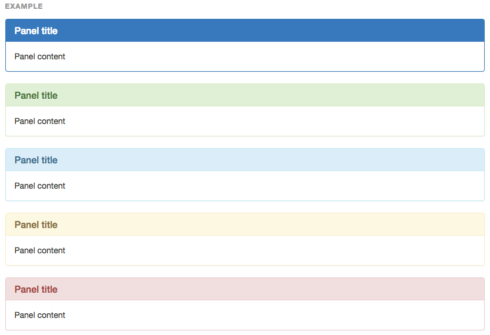
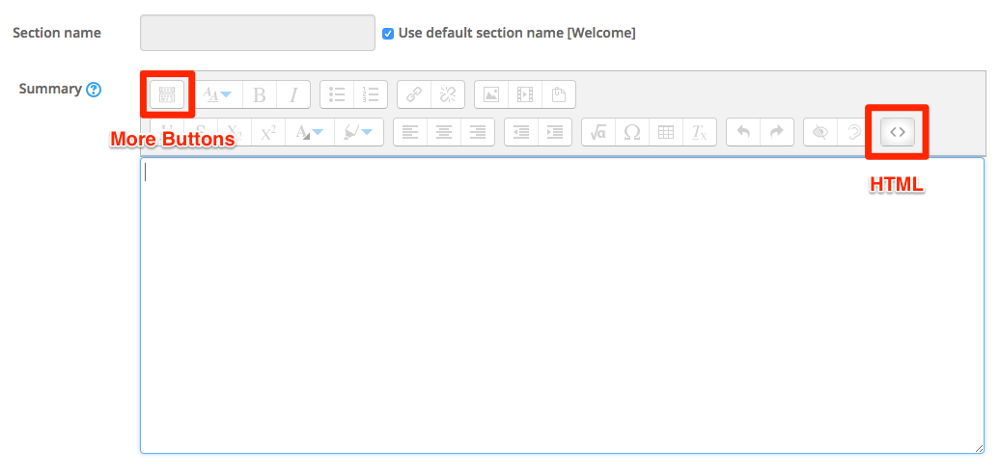
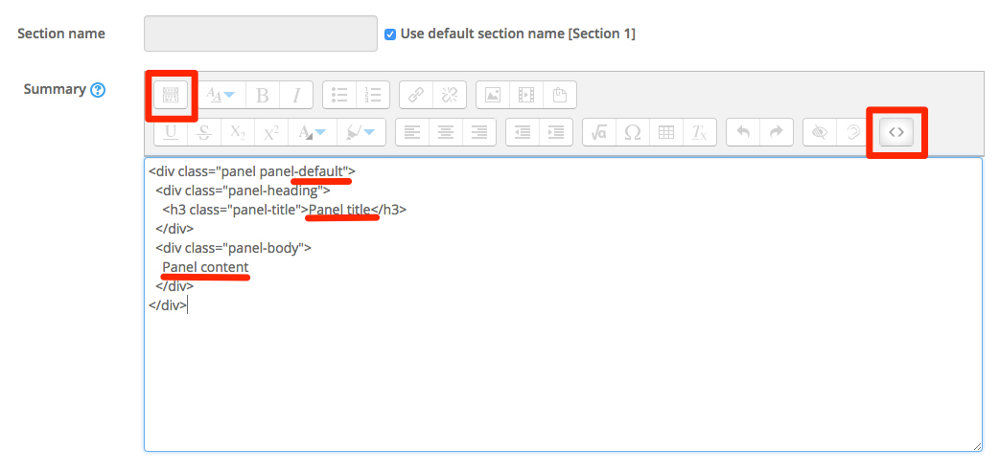
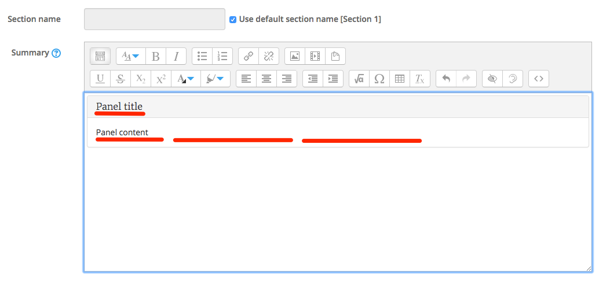

#Panels

We recommend using panels at the start of each section or with forums. As you can see from the image below we can use colors in panels titles

##Integration with Moodle

Integrating bootstrap code into Moodle is done exactly the same no matter which component that your using, its the same procedure, copy and paste the code, then in the activity or resource click on the "Show more buttons" button and then the HTML button

##Panel Code

Copy this code, then, with editing turned on click to edit section 1, then paste the code into the window.

~~~HTML

  

    <h3 class="panel-title">Panel title</h3>
  

  

    Panel content
  

~~~

You should see the following

As you can see I have highlighted some text, you can either change this text here or you can hit the HTML button and change the code in the WYSIWYG screen. *Note:* where is says default thats the color, if you want to use a different color you need to change this to one of the following

+ primary
+ success
+ info
+ danger
+ default

You wont be able to do this in the WYSIWYG window, and the same apply for changing the code behind buttons, you will to do this in the code.

Make your text or code changes and save your changes.

##Next

Move to the next step
