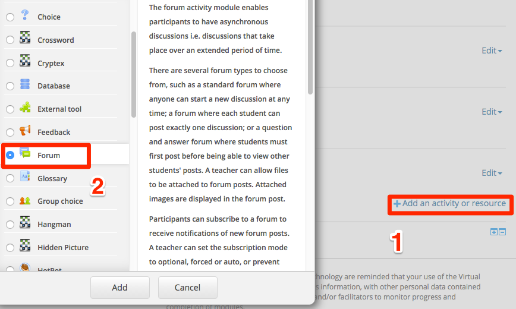
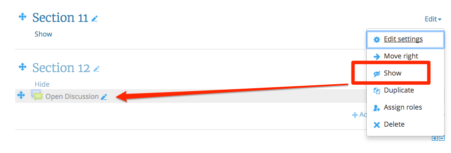

#Alerts

Alerts are a nice feature when you want to grasp the students attention

##Lets get setup

Make sure you have Editing turned on and scroll to the last section

+ Rename the last section to  "Hidden Resources"
+ Now edit the section and click on "Hide Section"
+ Click on Add and Activity or Resource and add a Forum 

+ In the Forum Name field Call this forum "Open Discussions"
+ Copy the code below into the HTML window 

~~~HTML

<b>Please Note:</b> 
this is a public forum, please remember the 
<a href="http://www.toptenreviews.com/services/articles/25-forum-posting-etiquette-tips/" 
target="_blank">rules</a> or the forum

~~~ 

+ Save your work 
+ Back on the main screen edit the activity and click show

I have introduced some changes to the bootstrap code, normally bootstrap give you the minimum code, you must make changes, so i introduced a hyperlink to an article on the web and I made some text bold (the code below is what I started with, I changed this in the WYSIWYG)

~~~HTML

  <a href="#" class="alert-link">...</a>

~~~ 

If you want to use a different color you need to change "danger" to another attribute, use one of the following;

+ warning
+ success
+ info
+ danger

Try and and take this code and place a new alert into this section