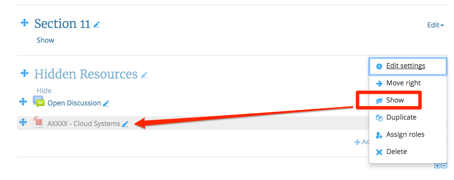
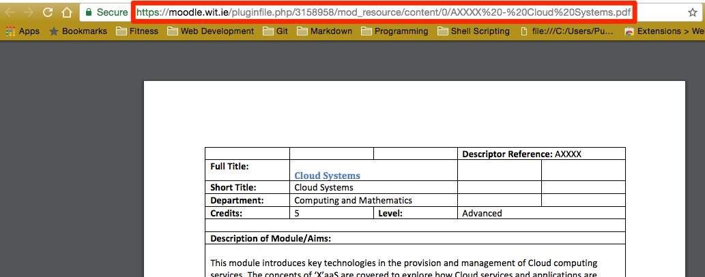
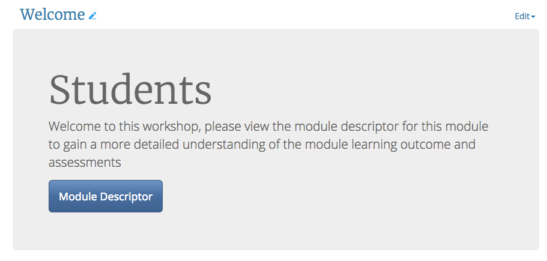

#Buttons

When we use bootstrap buttons in Moodle, we introduce some navigation, by this I mean you start direction students to resources, activities or external web pages.

##Back in the Jumbrotron

Remember earlier we introduced a Jumbotron and there was a button there with the "Learn More" text on it, now were are going to change a couple of things

+ Rename the text to "Module Descriptor"
+ Insert a new <a href="http://www.computerhope.com/jargon/h/hyperlin.htm" target="_blank">Hyperlink</a>

##Upload a document

+ In the <a href="https://moodle.wit.ie/course/view.php?id=101672" target="_blank">Reboot your Moodle Module area</a>, there is a section called "Documents" in that section there is a file there called "AXXXX - Cloud Systems" download this document to your desktop.

+ Upload this document from your desktop to the last section, the "Hidden Resources" section in your training area and make this visible by clicking "Edit settings" then "Show" 

##The URL

The <a href="hhttp://www.computerhope.com/jargon/u/url.htm" target="_blank">URL</a> is a web address of web pages or documents over the web

+ if you click on the AXXXX - Cloud Systems" document it should open in a new tab
+ copy the web address (the URL) in this new tab

##The code behind the button

+ Go back to the welcome section and navigate to the code behind the HTML button
+ inside there you should see the following code

~~~HTML

  <h1>Students</h1>
  
Welcome to this workshop, please view the module descriptor for this module to gain a more detailed understanding of the module learning outcome and assessments

  

    <a class="btn btn-primary btn-lg" href="#" role="button">Learn more</a>
  

~~~

The part of the code we are interested in is 

~~~HTML

   . . .  
  
<a class="btn btn-primary btn-lg" href="#" role="button">Learn more</a>

~~~

+ change the "#" after **href="#"** so that you end up with i.e. paste in the URL you just copied over the "#" after href="#"
+ change the Text in role="button">Learn more to role="button">Module Descriptor and save your changes

~~~HTML

  . . . 
  

    <a class="btn btn-primary btn-lg" href="https://moodle.wit.ie/pluginfile.php/3158958/mod_resource/content/0/AXXXX%20-%20Cloud%20Systems.pdf" target="_blank" role="button">Module Descriptor</a>
  

~~~

Now your Jumbotron should look like the image below

##Final Code

**Note:** I have place an extra piece of code in here so that when you click on the button it opens the document in a new window, can you spot it?

~~~HTML

  <h1>Students</h1>
  
Welcome to this workshop, please view the module descriptor for this module to gain a more detailed understanding of the module learning outcome and assessments

  

    <a class="btn btn-primary btn-lg" href="https://moodle.wit.ie/pluginfile.php/3158958/mod_resource/content/0/AXXXX%20-%20Cloud%20Systems.pdf" target="_blank" role="button">Module Descriptor</a>
  

~~~

