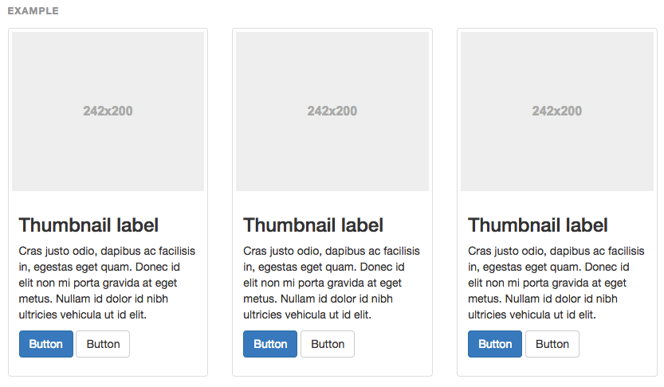
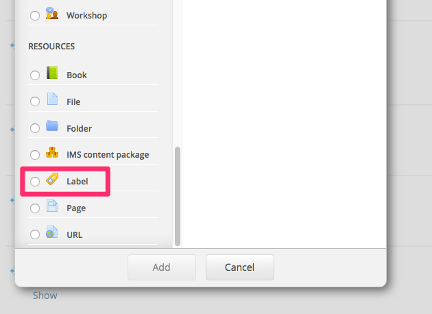
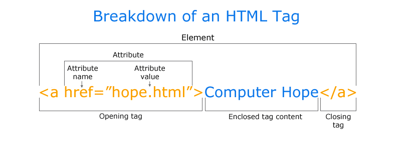
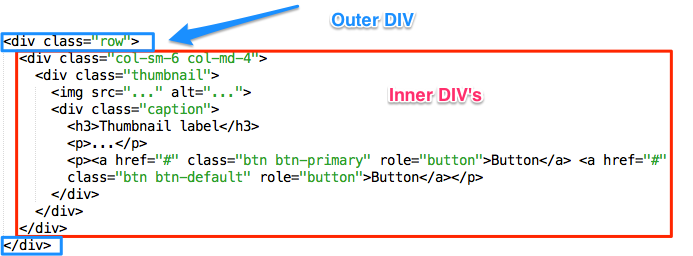
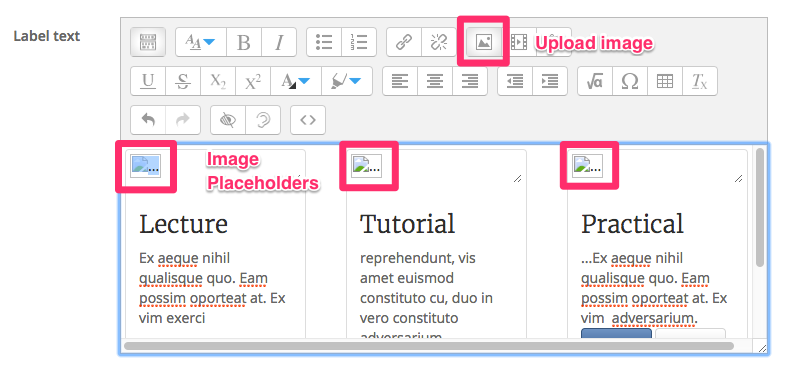
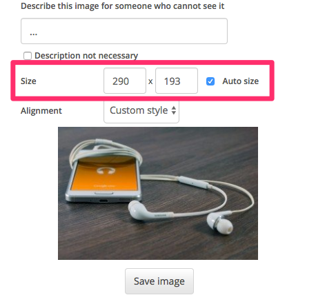

#Thumbnails

Visually thumbnails are great to combine navigation and content together, we can place 1, 2, or 3 thumbnails together, in our case we will use 3 thumbnails to demonstrate the concept of a Lecture, Tutorial and Practical for a topic you may teach.

##Images

find 3 images <a href="https://visualhunt.com/" target="_blank">from here</a> and save them on your desktop

##Bootstrap Thumbnails

##The Code

+ Copy the code below and then got to an empty section (section 2) and click on add and activity or resource and add a label (its a resource scroll to the end)

+ Click on the HTML button on the label window and paste in the code

~~~HTML

  

    

      
      

        <h3>Thumbnail label</h3>
        
...

        
<a href="#" class="btn btn-primary" role="button">Button</a> <a href="#" class="btn btn-default" role="button">Button</a>

      

    

  

~~~

##Tags

This is the break down of what a tag is and its contents, this is not too important, but what is important is that you are aware that tags have an opening and closing tag.

+ The HTML Element looks like this

##Back to Moodle

If you paste this code in 3 times for 3 thumbnails then you will end up with 3 vertical thumbnails, we don't want that, we want them horizontal, so you must paste in the code the first time then copy the inner code (see below) and paste that inside **outer DIV**

> So the code you need to place inside the outer DIV tags is

~~~HTML
  

    

      
      

        <h3>Thumbnail label</h3>
        
...

        
<a href="#" class="btn btn-primary" role="button">Button</a> <a href="#" class="btn btn-default" role="button">Button</a>

      

    

  

~~~

##Headings, Text and Images

+ If you click on the HTML button again you should see the result in the WYSIWYG window
+ Change the headings from **Thumbnail Heading** to Lecture, Tutorial and Practical
and change the text under each heading as well to reflect the item (a summary)
+ click on the image and upload the images into the 3 image placeholders

Don t forget you can also adjust the size of the image, you might have to play around with this. you can also introduce some navigation with the buttons, i.e. point to lecture notes, labs files, URL's etc.

##Result

##Next

Move to the exercise

