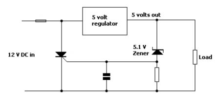
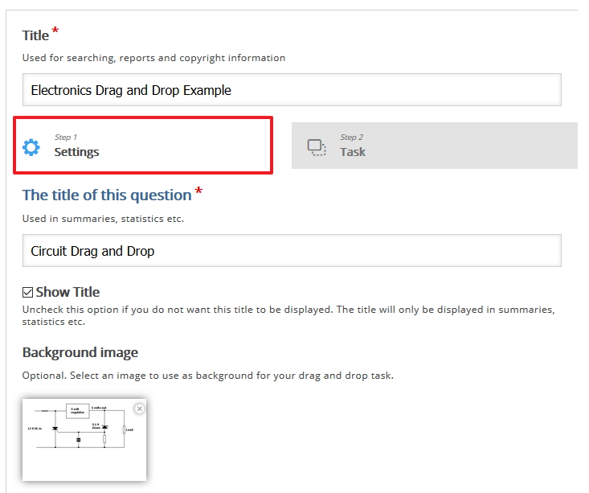
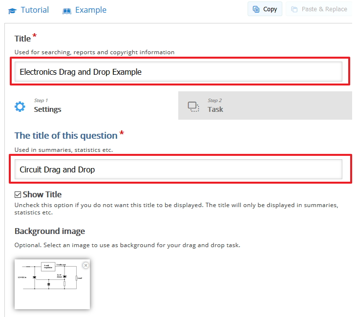
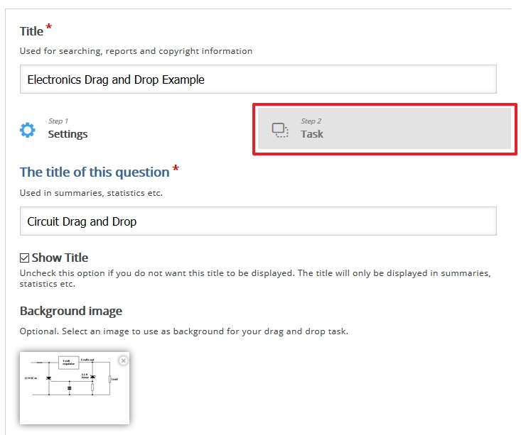
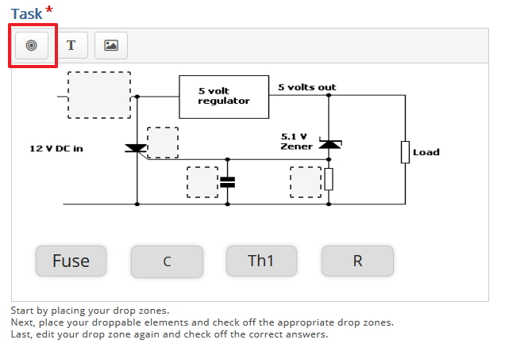
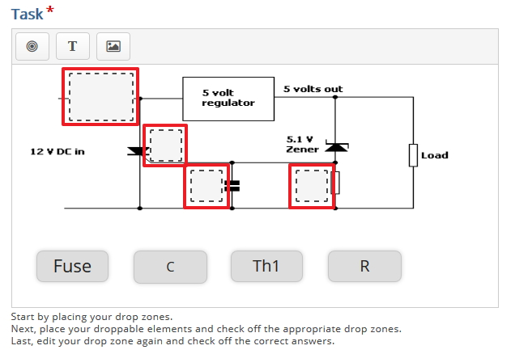

# Settings and Tasks

## The Build

So now that you have selected the Drag and Drop component we will now start to build the details

## Images

Depending on what your context is you will need to "add" a background image, I have choose and electronic circuit board as my background image, you can source your own image.

## in Settings

We must give the component a title and we must also provide a title of this question, see image below

## in Tasks

Now we must provide "drop Zones", again depending on your context you need to insert a drop zone in a particular position on the image 

Start by inserting your drop zones.

Once you have created your drop zone you can click on a drop zone and move by dragging the dropzone to the desired location.

