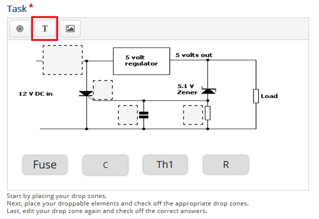
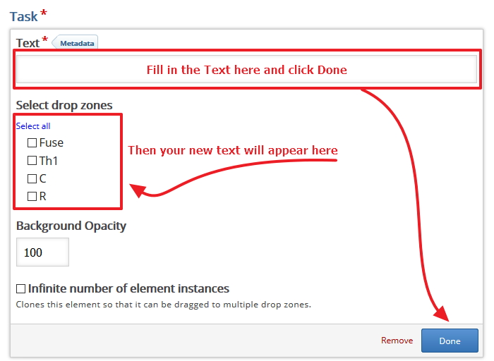
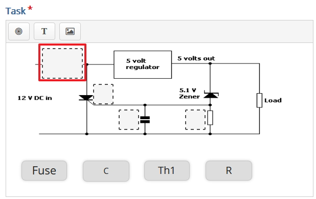
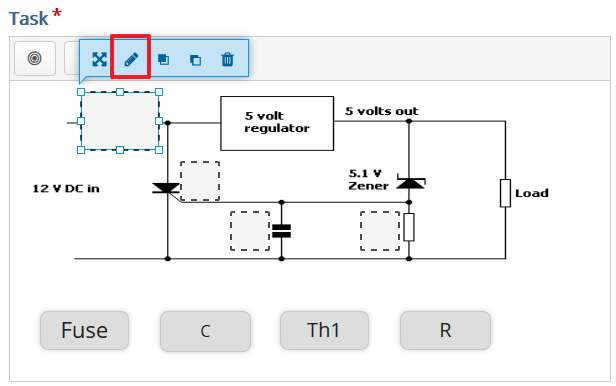
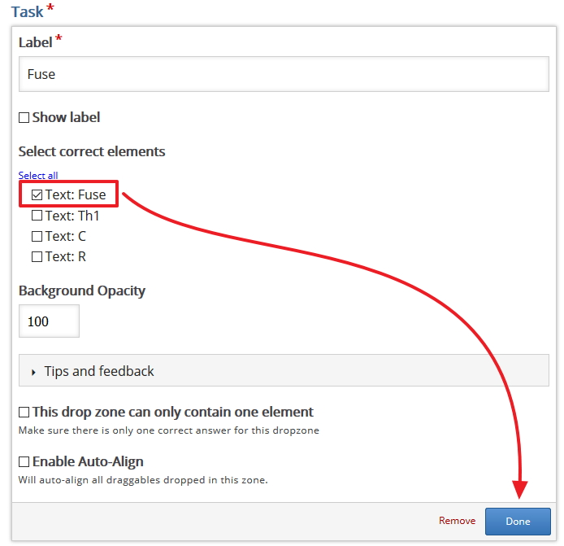

# Links and Code Blocks

## Text

No that you have the drop zones in place you now need to create the associated texts that the student will use to drag and drop onto the drop zone, when we create the text will must tell each one which is the correct drop zone.

For this example I am going to create 4 different texts that I can use in this Drag and Drop example

Q

## Associate the Correct Text with each Drop Zone

Now that we have Drop Zone and we have Text we now need to associate the correct texts to the right drop zone, we can do this by clicking on the drop zone and choosing the correct text.

Then make the association between the drop zone you just clicked on the the correct text, this means when the student drags and drop that text onto the drop zone H5P will make the association and decide if the user is correct or not.

Now all you have to do is make the correct association and save you changes by clicking done, note repeat this step as needed, so in this example I have 4 texts so I will make 4 associations.

## Next

Move to the Exercise 

