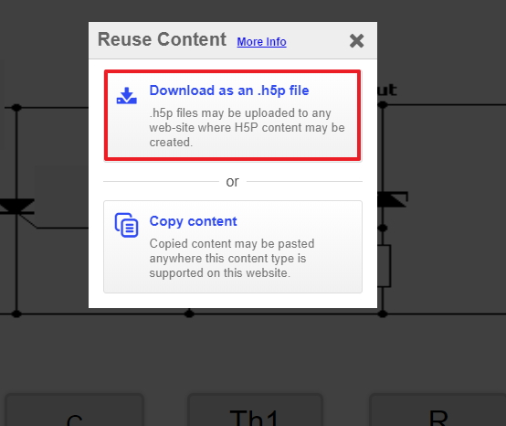

# Feedback

## Overall Feedback

This is the last step all we need to do now is add in some feedback so that user can have immediate feedback while interacting with the drag and drop activity.

On you Moodle page for the score range of 0% to 100% add the following text

~~~html
You got @score of @total points
~~~

## Overall Feedback

We are now in in a position to test, if you click save and display on you Moodle page you should be able to see your drag and drop activity and you can test and make the necessary changes.

