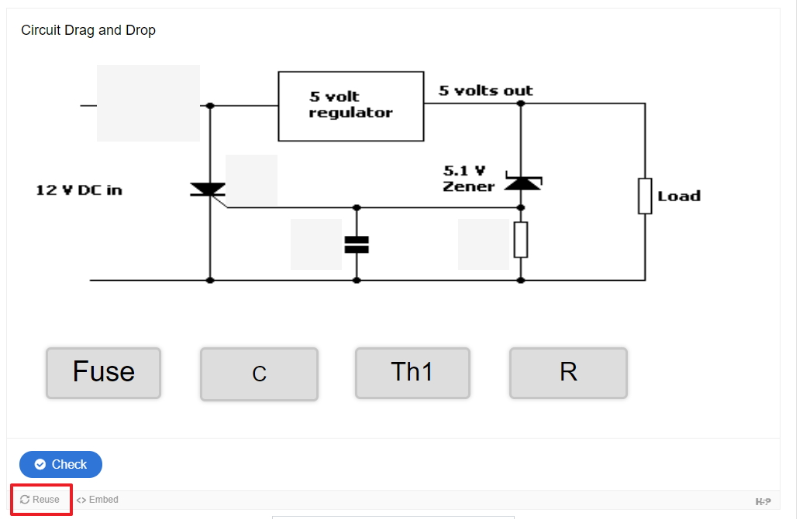
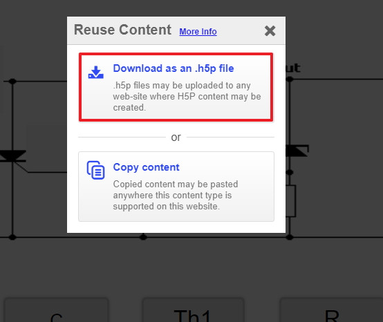

# Exercises

To complete this workshop please complete the drag and drop activity in Moodle

## Feedback

Please let us know if you had any issues with this workshop, we want to make improvements but we need you help, please take a few moment to fill in <a href="https://b.socrative.com/student/#quiz" target="_blank">this feedback</a> we appreciate all comments and suggestions 

## Accreditation

In order to receive your accreditation you will have to upload and submit your Drag and Drop activity along with your documentation in the Moodle Drag and Drop section in the H5P workshop area in Moodle

## step 1

First, you must download the drag and drop activity from your Moodle sandbox page, in order to download first view the H5P activity in Moodle in the bottom left of the screen you should see an option to reuse, click reuse 

You can download the H5P activity bu selecting the **Download as an .h5p file** option

## step 2

This file should be in your downloads folder on your computer, drag and drop that file from download to the dropbox area into the assignment submission area in Moodle, and click the **add submission** button <a href="http://conorpaul.com/moodle35/mod/assign/view.php?id=14" target="_blank"> here </a>, don't forget to also submit your documentation from the Moodle <a href="http://conorpaul.com/moodle35/course/view.php?id=9#section-2" target="_blank">Drag and Drop</a> section along with this H5P file download.

