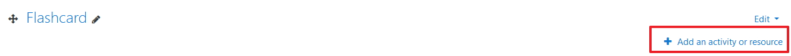
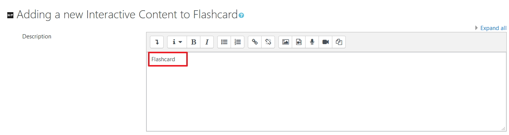
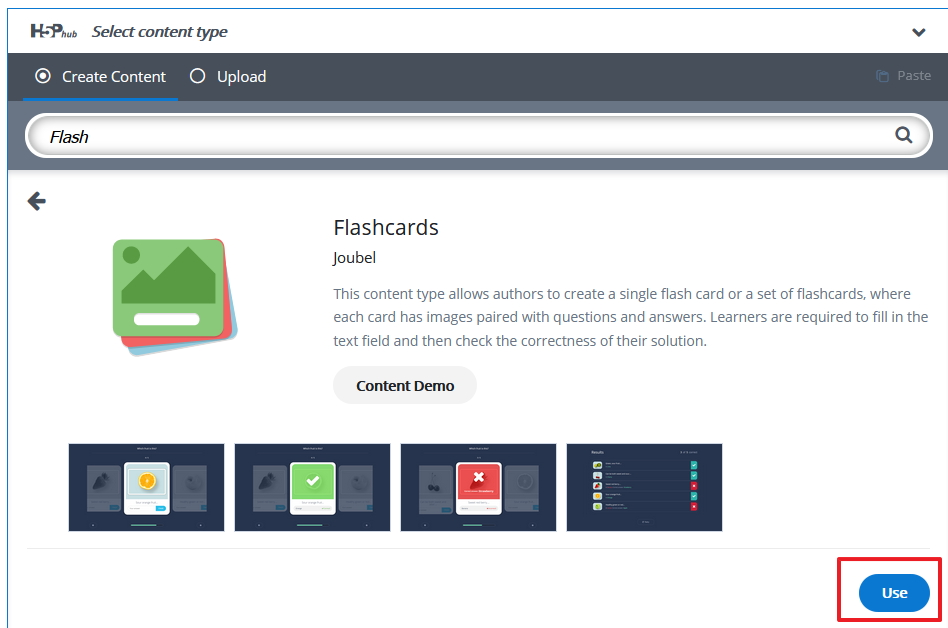

# lets get started

To view the Flashcard component on the H5P website please follow the example link on the workshop page or click <a href="https://h5p.org/flashcard" target="_blank">here</a>

## The Context

So for this example I will use some example from the Science periodic table

## Log into Moodle

Log into Moodle <a href="http://conorpaul.com/moodle35" target="_blank">here</a>  and navigate to your sandbox area where you want to use the H5P flashcard component, at this stage we will start the process by adding the H5P Interactive Content type in Moodle.

## Adding the activity

I have decided to call the section Flashcard example but you may want to use some other name which is okay, select the Add an activity or resource option.

## Add in Interactive Content

Now select the Interactive content type from the pop-up list

## Search and use the correct Interactive Component

A this stage you will start to build the H5P Interactive content. Select or search find the editor for the component you plan on using, in this case it the Flashcard, so I have started the search for "Flash"

Now you should see the flashcard component select the detail button 

Now we can use this component now by selecting the "use" button

## Next

Move to step 02 in the lab

