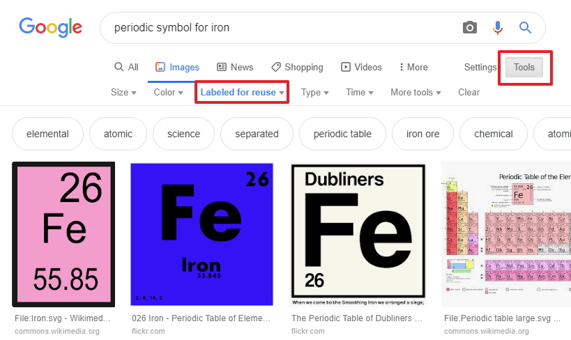

# Images

For this example I had to source images from the periodic table, I did a google search for free iamges from the perodic table

## Free images

You can search for royalty free images using a Google search, all you have to do is search for the images. select tools from the menu then select your preferred license type, I choose images labeled for reuse.

