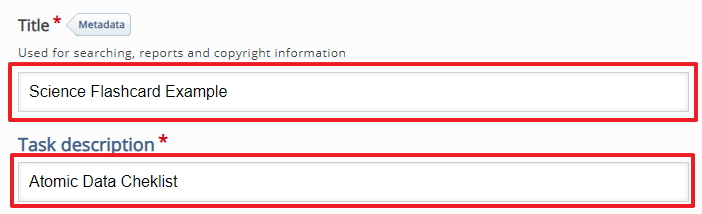
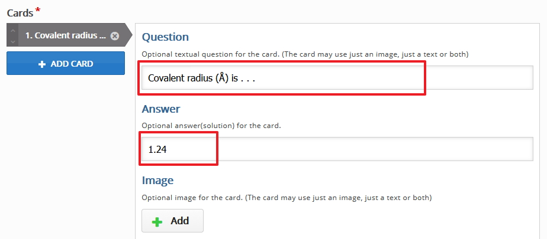
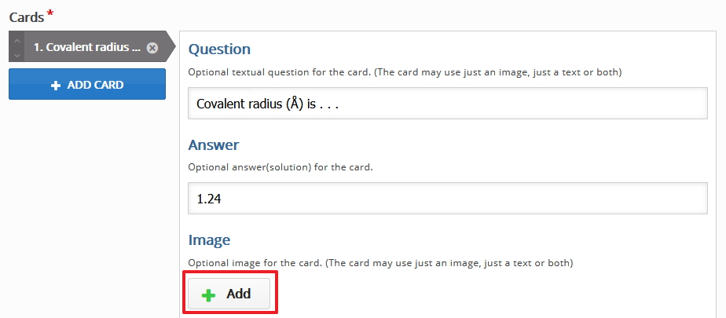
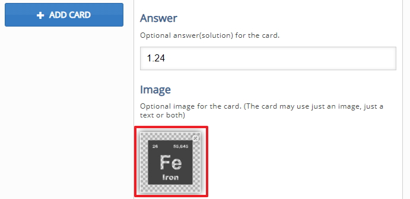

# Images

For this example I had to source images from the periodic table, I did a google search for free iamges from the perodic table

## Free images

You can search for royalty free images using a Google search, all you have to do is search for the images. select tools from the menu then select your preferred license type, I choose images labeled for reuse.

## Flashcard Images

If you want you can use my images for example from the periodic table, download the archive - [here](./archives/archive.zip) and unpack the archive to use the images.

## Flashcard content

The way this flashcard works is the student will be presented with an image and a question and they supply an answer, in this example we are going to use 3 images and 3 associated questions.

## Flashcard setup

Once you have chosen to use the flashcard you searched for in the previous step you now have to start to build the content

Start by setting up the Title and the Task Description, for this example you can follow my example or if you want to use you own thats fine.

## Flashcard Question

No you can start to set up the first question, in order to do this you must fill in the question text in the field provided followed by the correct answer, see image below.

We will ask them what is the Covalent radius (Å) is . . . associated with the Iron element from the periodic table, the answer is 1.24

## Flashcard image

Now you can associate an image with the question, upload your image from you computer that you have chosen or if you want please feel free to use the images supplied in the archive.

You should now have the image in place

## Next

Thats the first question done, move to step 03 to add a new question.