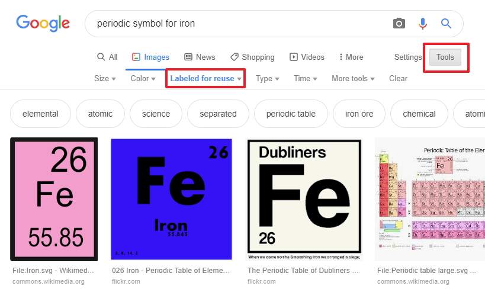

# The thrid question

This is the third (last) of three questions

## Free images

If you want you can use my images for example from the periodic table, download the archive - [here](./archives/archive.zip) and unpack the archive to use the images.

Or you can can search for royalty free images using a Google search, all you have to do is search for the images. select tools from the menu then select your preferred license type, I choose images labeled for reuse.

## Flashcard Question

No you can start to set up the second question, in order to do this you must add a new card

Again, fill in the question text in the field provided followed by the correct answer. We will ask them what is the Electron affinity (kJ mol−1)  . . . associated with the Radium element from the periodic table, the answer is 9.65

## Flashcard image

Now you can associate an image with the question, upload your image from you computer that you have chosen or if you want please feel free to use the images supplied in the archive.

You should now have the image in place

## Testing

Thats it your finished creating the flashcard component all you have to now is save all your changes and test you work to make sure everything works as it should.

As you work through the component in Moodle you will be presented with the result as the student would see them and it will also give the student the option to retry.

## Next

Move to the Exercise 