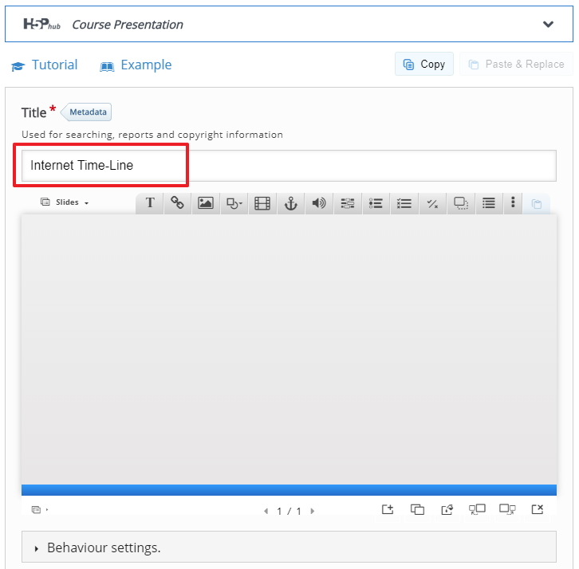
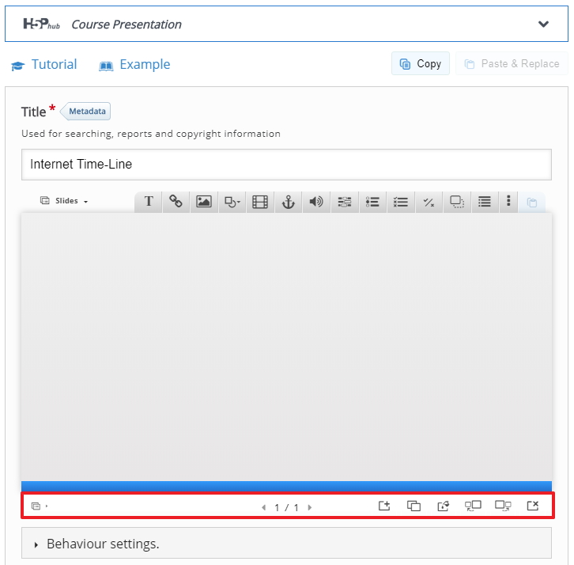
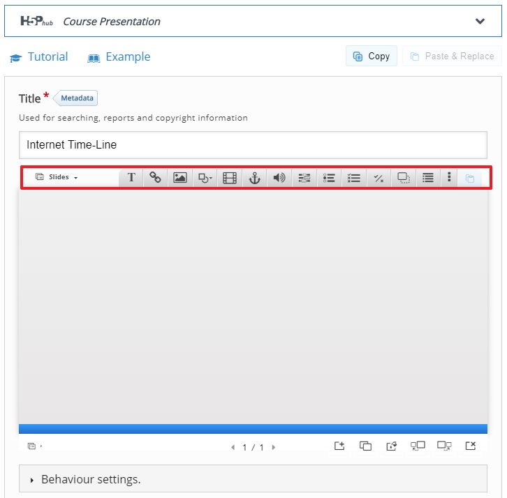
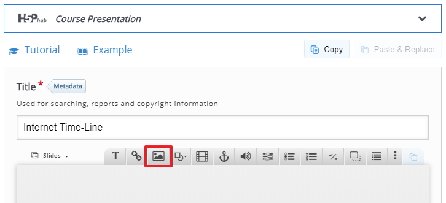
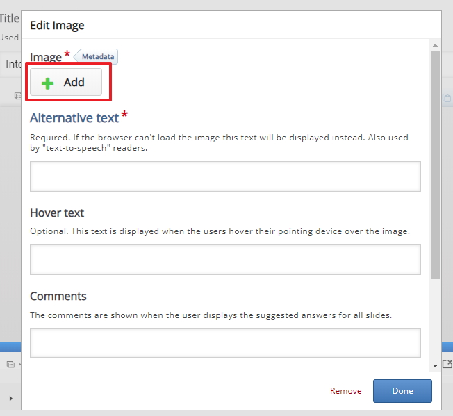
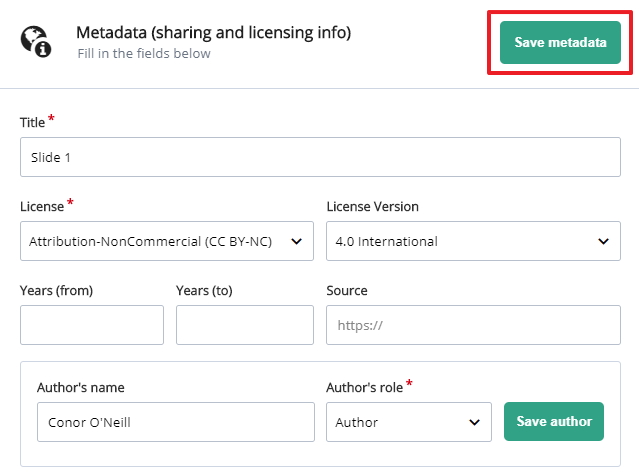
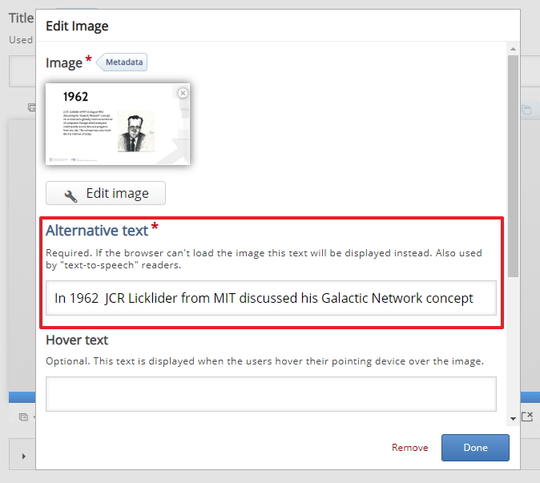
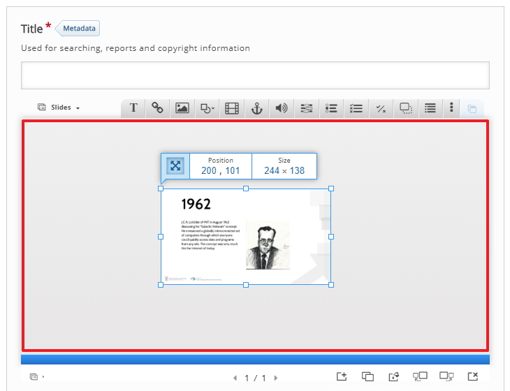

# Presentation context

This screen is slighty more complicated then previous workshops screens, what were are doing on the presentation setting screen is adding slides (images), this could be screenshots of the slide you covered in a lecture or they could be a summary version of toy slide you covered in a tutorial for example.

## Settings explained

On the screen we see a few part that we need to explain first before we continue, starting with the Title, which is the title the user will see on the Moodle page. in this example I have called it "Internet time-line".

## Adding Slides

At the bottom of the screen you will see an option to add a slide, delete a slide etc, you also see the slide number.

##  Adding content to a slide

When you add a slide you then can add content to each slide via the options at the top of the screen, so you can add an image to your slide, you can add in a video, hyperlink, text, Multiple Choice Questions, fill in the blanks, true or false and more. For this example we will add in images and we will also add in some questions for interactivity and student engagement 

##  Slide 1

For the first slide I will add an image of content that I covered with some student and it covers the topic of the Time-line of the Internet, I have an image (.jpg) and I will add that to the slide.

Next I will add to add the image by search for the image on my computer and adding it to the slide, you can leave the other fields blank for now

If you want you can add some copyright information via the Metadata option

When you add in your image to the slide you will also have to type an alternative text, this could be a heading or a summary of the slide, Note: you will have to do this with every image you add to any slide.

##  Resize Slide 1

You can now resize the image to the required size, in this case I'm going to make it fit to the whole screen by clicking and dragging the side of the image to the edges of the screen.

##  Next

Move to the next step.