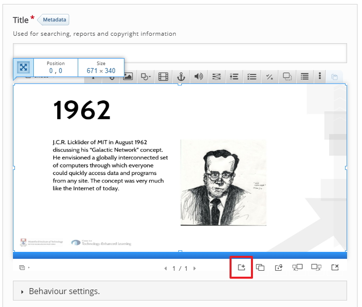
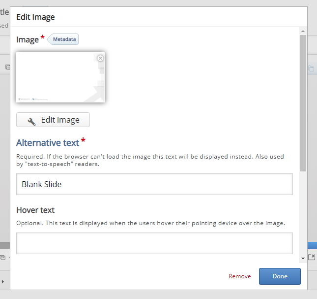
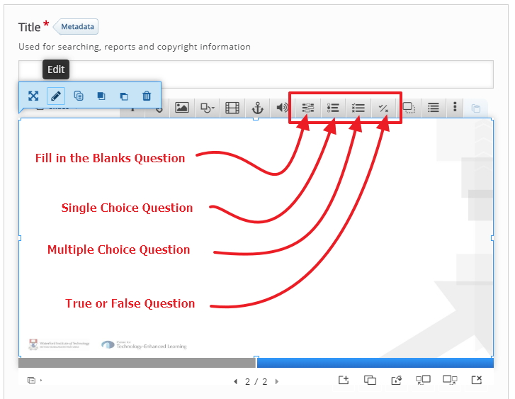
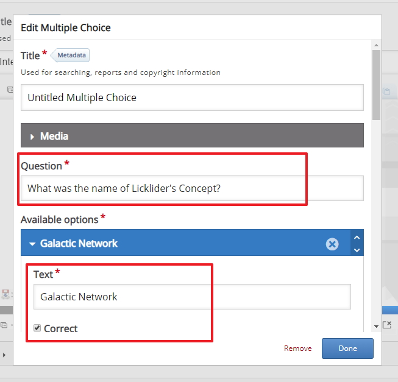
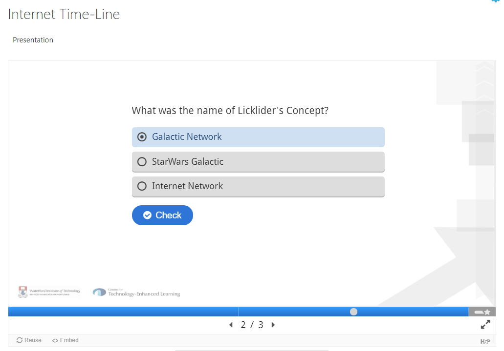
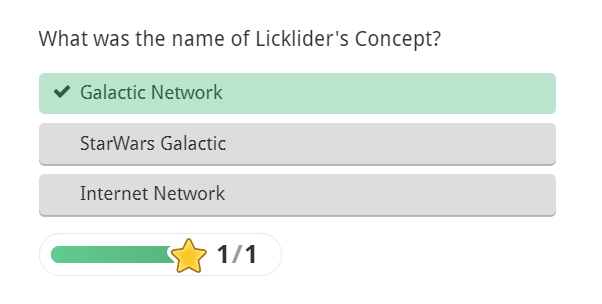

# Adding Questions

There are number of ways to achieve this, I'm going to include a blank slide after each content slide for the questions, this just make to a little easier to separate the questions from the content.

##  New Slide

After you have adjusted the size of you image on slide 1 click on the image to add a new slide

You can at this just add in the question or of you want you can add in an image, it doesn't matter really if you want to keep a consistent look and feel to this activity I would suggest using an image.

## Question Types

There are number of different question type see below, for this example we will use the multiple choice question type

## Slide 2 Question

After I placed the blank image on the slide 2 I then used a multiple choice question, I included the question "What was the name of Licklider's Concept?" and I also included 3 options, you have a choice of which option is correct (the first one is the correct one in this case)

This what the students will be presented with when they reach slide 2 on the interactive H5P presentation.

And after they check their answer.

##  Next

Move to the next step.