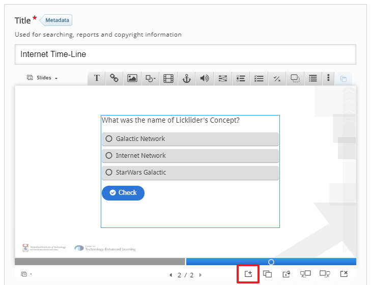
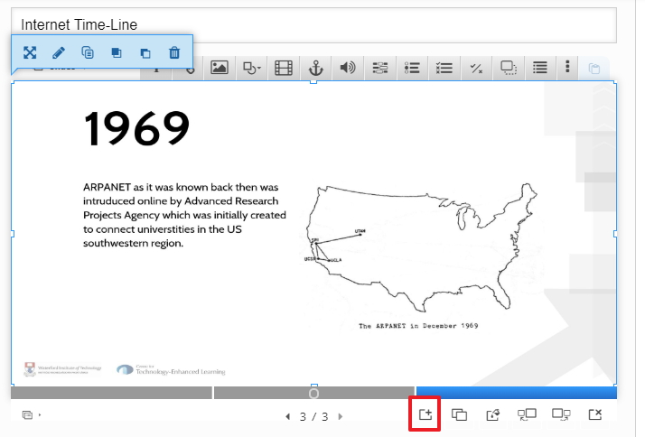

# Adding more slide

we have already include out content first slide and out first question slide, we will now repeat this by adding in anotehr slide but this time we will add a new question type.

## Add a new Slide

To add a new slide to your existing slide just click the add slide icon

## Add a new image

To add in a new image click the add image icon and upload you new image from your computer, don't forget to adjust the size of your image so tat it fits in the entire screen

## Add a new question Slide

To add a new question slide to your existing slide just click the add slide icon

## Add a blank image

On the question slide we just need a blank image, pr a blank background, so you have a couple of options, you can;

1. Upload a blank image like you did for the first question
2. You can leave the screen blank (don't upload any image)

For this example I am going to upload a blank image like we did for the first question type just to be consistent, so now you should have 4 slide and the 4th slide should be blank, again make sure you ajust the size of the image so it fit on the entire screen.

## Add the Question

After I placed the blank image on the slide I then used a **fill in the Blanks** question on the blank slide, I included the question "ARPAnet stand for Advanced *Research* *Projects* Agenct Network" this is actually classes as 2 questions in 1 because the student has to fill in 2 blanks.

The output will look like the following

## Adding more slides

You have added 2 content slides and 2 question slides, the process of adding more slides is the same, ito add more slide just repeat step 03 for each slide you want to add.

## Next

Move to the exercise

