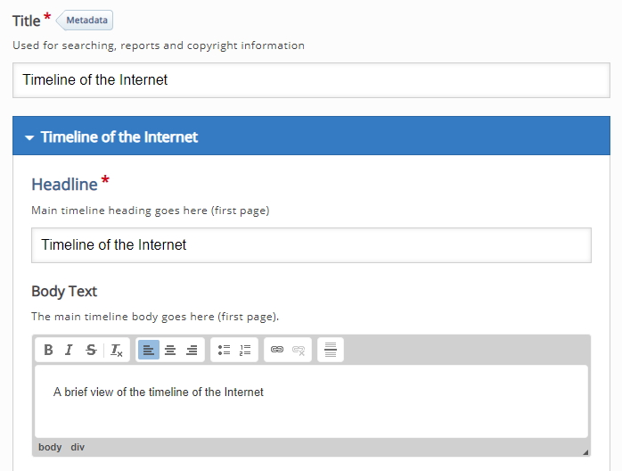

# Timeline context

This screen is slighty more complicated then previous workshops screens, in this example we are going to build a timeline of the internet so that the student can navigate through the timeline and see all the major dates that happen as part of the Internet, I will be using some slides that I prepared earlier (for the Presentation Workshop) and I will use those as my images.

## Settings explained

On the screen we see a few part that we need to explain first before we continue, starting with the Title, which is the title the user will see on the H5P Activity screen. in this example I have called it "**Timeline of the Internet**", we can also add a short introduction and if you like you can add an image, all of these will appear on the start screen for you timeline.

You now should have something like this image. 

## images explained

If you decide to use an image as an asset for a particular date then H5P is very rigid when it comes to using images, it is possible but from my experience its best to use images from <a href="https://commons.wikimedia.org" target="_blank">Wikipedia Commons</a>

## Search Wikipedia Commons 

So if you want to include an image you will need to search for an image, I have searched for Licklider and got these results, I now need to click on the File resources for the image

## How to use this file

After you have clicked on the file resource now you have to get the **File URL** and you can get this by clicking ion the *Use this file* 

Copy the file URL so that you can use this later and include this image as an asset

## Dates

Next we need to include the dates for this part of the timeline - in this case I'm going to start at 1962 as the start date and because this part of the time line is about JCR Licklider I will use some heading with JCR Licklider in the title and also a brief peice of information about JCR Licklder for the bodytext.

You now should have something like this image.

## Assests

You can also include some **assets**, in this case I will include a media hyperlink that we copied earlier and we also wil include credit to Wikipedia Commons

You now should have something like this image.

## Save changes and Test

At this point we have out first date (1962) in place we should now save out changes and test, we might need to to make changes.

When you display the timeline you should be able to see something like the image below

## Next

Move to the next step

