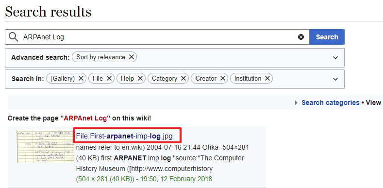
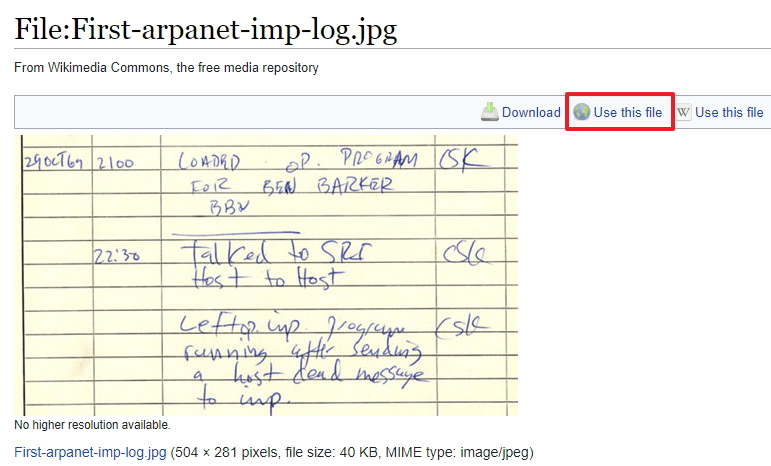
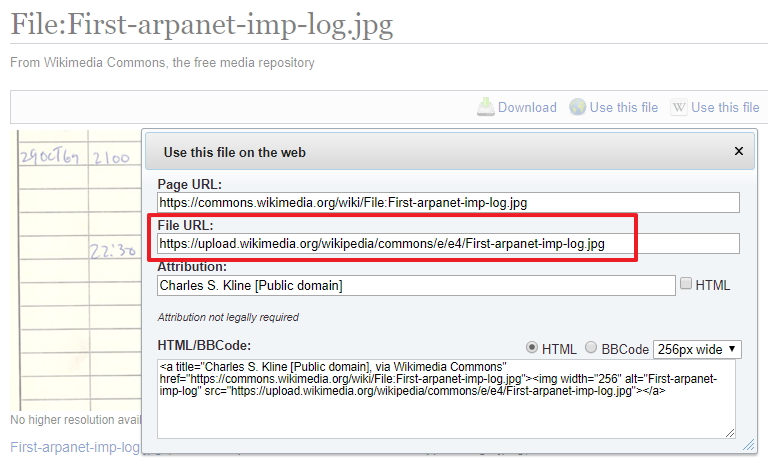
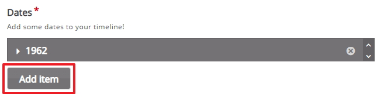
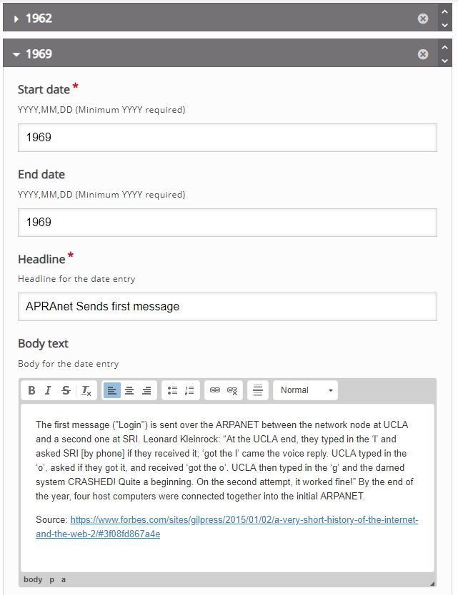
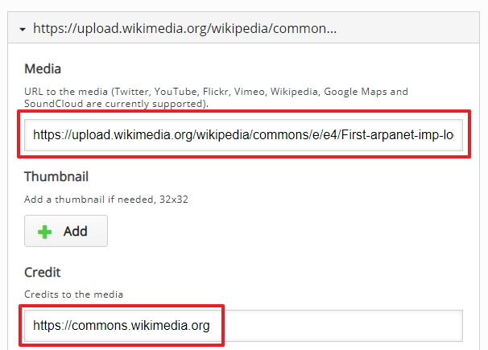
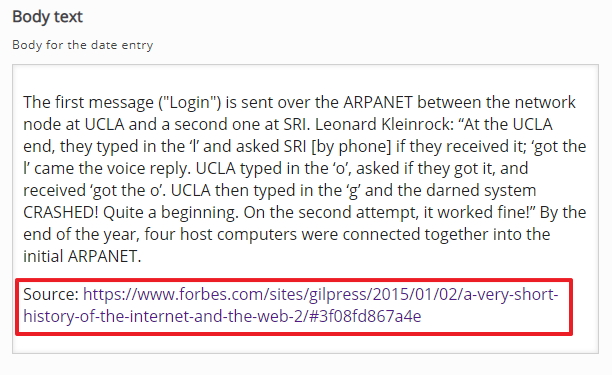
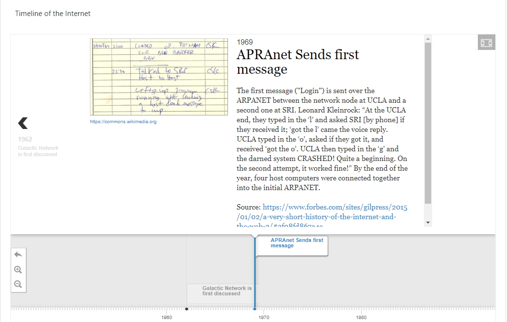

# Adding more dates

We have already added in one date (1962) now we can add another date, this time we will add content for 1969 and this date will be about ARPAnet which was one of the founding research centers responsible for the development of the Internet.

## images explained

Again if you decide to use an image as an asset for a particular date then H5P is very rigid when it comes to using images, it is possible but from my experience its best to use images from <a href="https://commons.wikimedia.org" target="_blank">Wikipedia Commons</a>

## Search Wikipedia Commons 

So if you want to include an image you will need to search for an image, for the 1969 date I have searched ARPANET Log and got these results, I now need to click on the File resources for the image

## How to use this file

After you have clicked on the file resource now you have to get the **File URL** and you can get this by clicking ion the *Use this file* 

Copy the file URL so that you can use this later and include this image as an asset

## Create a new Date

We now need to add a new date, click the **add term** button just below your current date, for this example I will call the new date 1969 you can use you own date or feel free to follow my example

## Dates

Next we need to include the dates for this part of the timeline - in this case I'm going to use 1969 as the start and end date and because this part of the time line is about ARPAnet I will use some heading with ARPAnet in the title and also a brief piece of information about ARPAnet for the bodytext.

You now should have something like this image.

## Assests

You can also include some **assets**, in this case I will include a media hyperlink that we copied earlier and we also will include credit to Wikipedia Commons

You now should have something like this image.

## Reference

Were possible you should reference your work, in the body text of the asset I have used information from <a href="https://www.forbes.com/sites/gilpress/2015/01/02/a-very-short-history-of-the-internet-and-the-web-2/#3f08fd867a4e">this Website</a> and I have included that link in the body text as my source. 

 

## Save changes and Test

At this point we have out second date (1969) in place we should now save our changes and test, we might need to make changes.

When you display the timeline you should be able to see something like the image below

## Next

Move to the next step