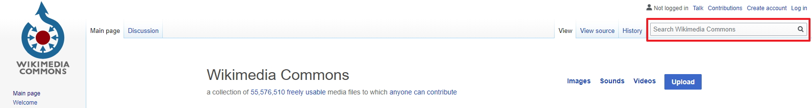
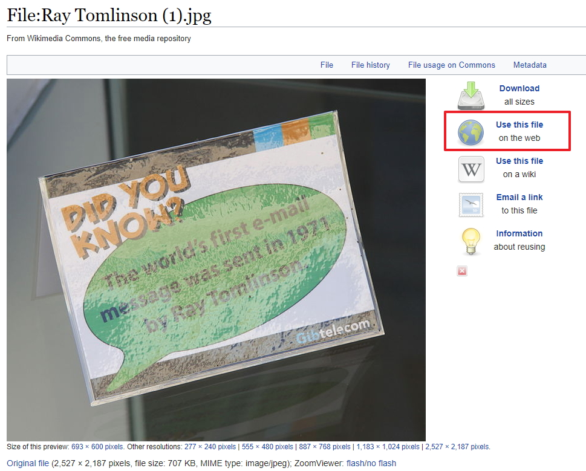
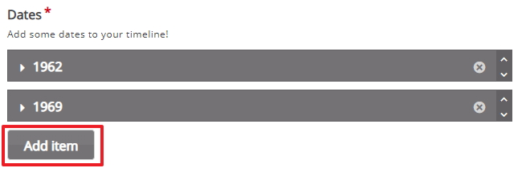
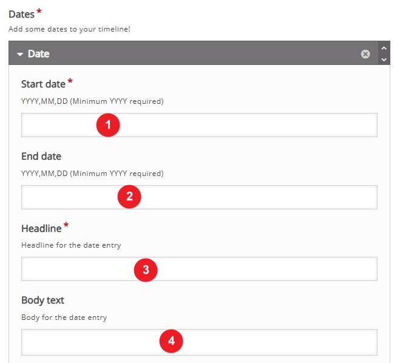
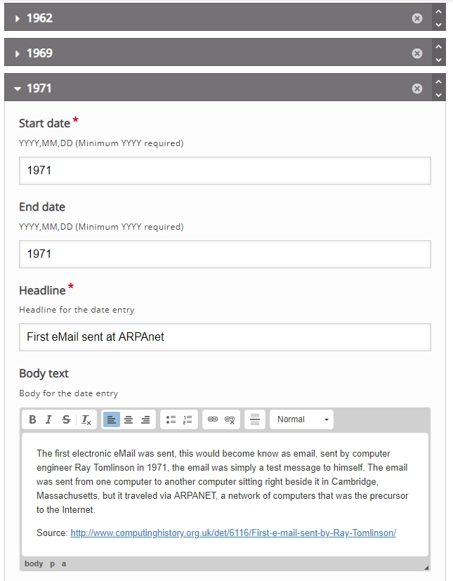
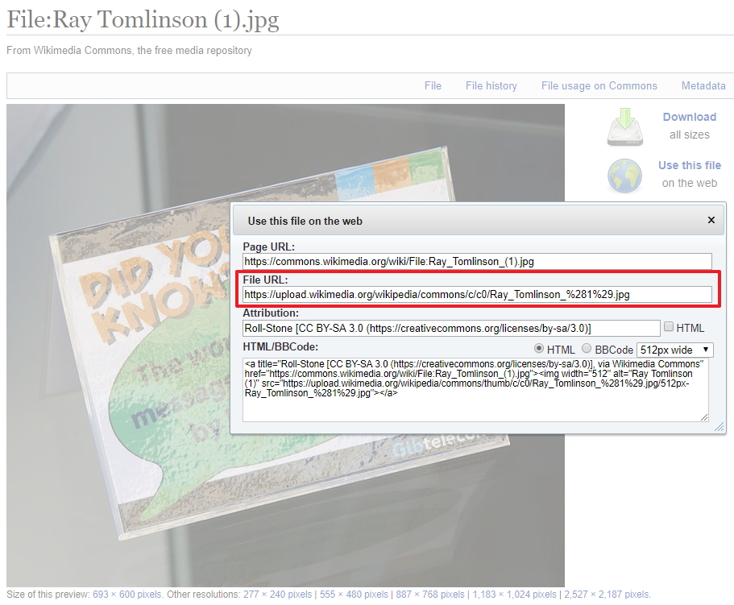
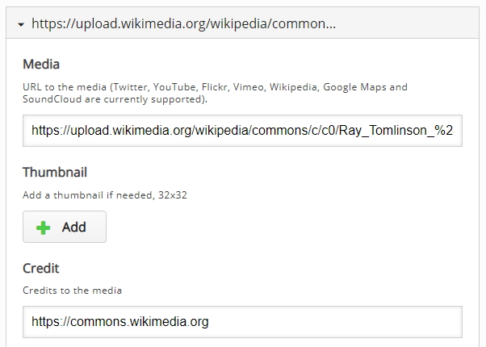
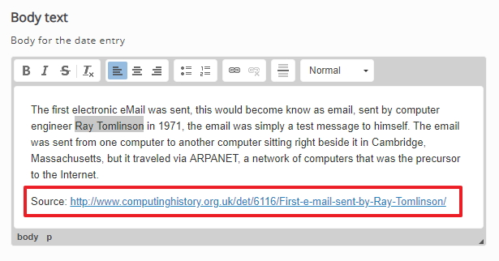
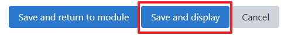
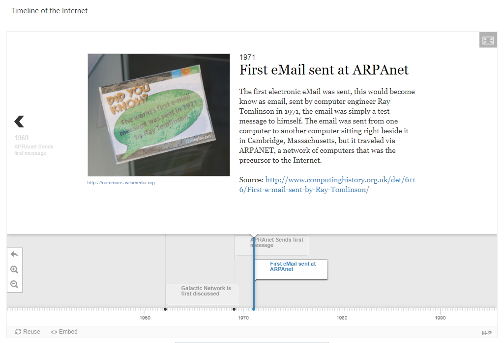

# Adding more dates

At this point we have two dates (1962) and (1969) in place, we will add an other date now and if you want to add a further dates its will be just a case of repeating this step taking in account what you have learner about sourcing images and also how to crete new dates.

## images explained

Again if you decide to use an image its best to use images from <a href="https://commons.wikimedia.org" target="_blank">Wikipedia Commons</a>

## Search Wikipedia Commons 

So if you want to include an image you will need to search for an image, for the 1969 date I searched "**Ray Tomlinson**" and got this result, in order to use this file click on the "Use this file on the web" and copy the **file URL** link so that you can use this later and include this image as an asset

## Create a new Date

We now need to add a new date, click the **add term** button just below your current date just under 1969 for this example I will call the new date 1971 and in that year the first email was sent by Ray Tomlinson at APRAnet in 1971

## Dates

Next we need to include the dates for this part of the timeline - in this case I'm going to use 1971 as the start and end date and because this part of the time line is about eMail I will use some heading with eMail in the title and also a brief piece of information about eMail for the bodytext.

You now should have something like this image.

## Assests

You can also include some **assets**, in this case I will include a media hyperlink that we copied earlier and we also will include credit to Wikipedia Commons

You now should have something like this image.

## Reference

Were possible you should reference your work, in the body text of the asset I have used information from <a href="https://www.forbes.com/sites/gilpress/2015/01/02/a-very-short-history-of-the-internet-and-the-web-2/#3f08fd867a4e">this Website</a> and I have included that link in the body text as my source. 

 

## Save changes and Test

At this point we have several dates (1992, 1969 and 1971) in place we should now save our changes and test, we might need to make changes.

When you display the timeline you should be able to see something like the image below

## Next

Move to the exercises