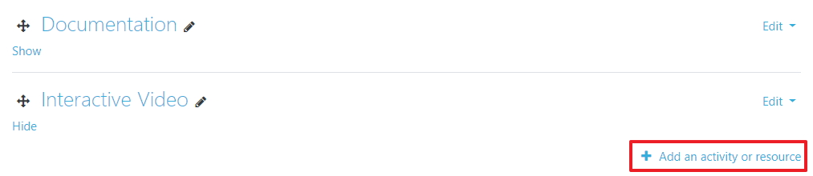
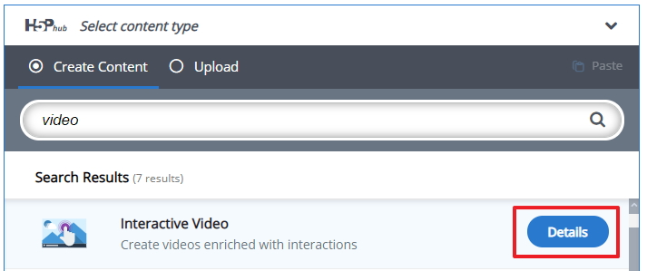

# lets get started

To view the video component on the H5P website please follow the example link on the workshop page or click <a href="https://h5p.org/video" target="_blank">here</a>

## The Context

So for this this workshop, we are going to develop an interactive H5P video that we create in Moodle and we will include multiple choice and true or false type questions in the video, the video will stop playing at the question and will resume after the questions is answered.

## Log into Moodle

Log into Moodle <a href="http://conorpaul.com/moodle35" target="_blank">here</a>  and navigate to your sandbox area where you want to use the H5P Video component, at this stage we will start the process by adding the H5P Interactive Content type in Moodle.

## Adding the activity

I have decided to call the section **Interactive Video** but you may want to use some other name which is okay, select the Add an activity or resource option.

## Add in Interactive Content

Now select the Interactive content type from the pop-up list

## Search and use the correct Interactive Component

A this stage you will start to build the H5P Interactive content. Select or search find the editor for the component you plan on using, in this case it the Timeline, so I have started the search for "time"

Now you should see the Timeline component select the *details* button 

Now we can use this component now by selecting the "use" button

## Next

Move to the next step 
