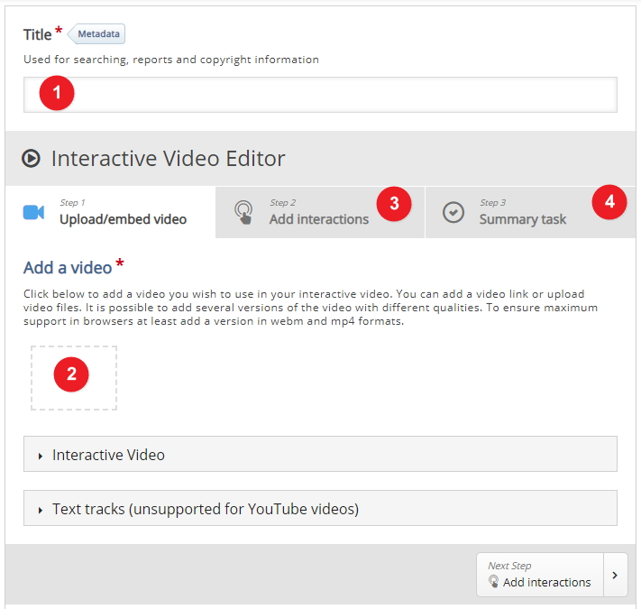
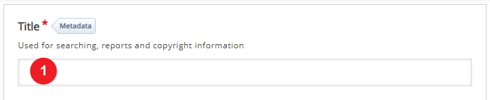
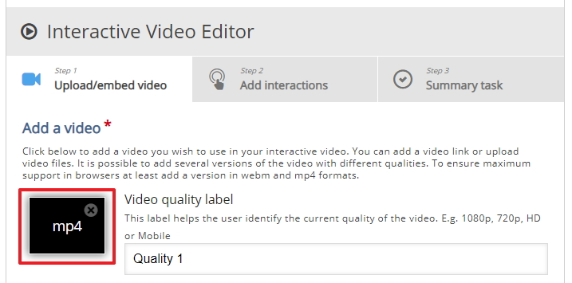
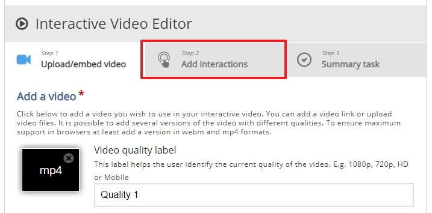
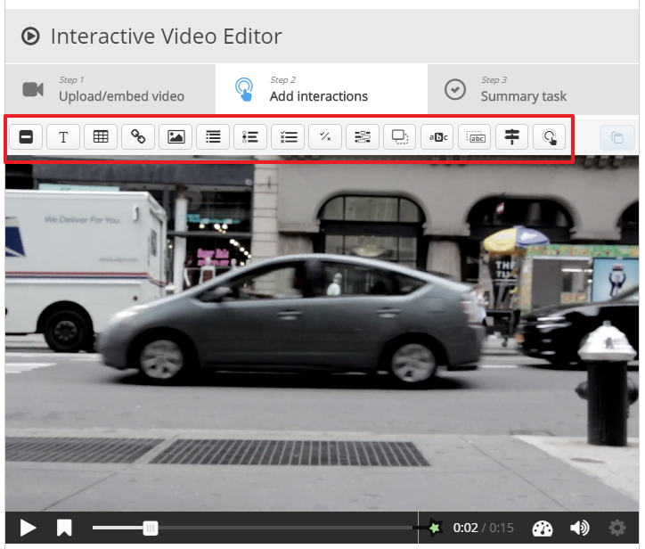

# Video context

In this example we are going to build an interactive video and we will insert different questions into the video to make it stop for the students to answer the various questions, the video will resume play when the student answers the question at the point in the video.

## Settings explained

On the screen we see a few setting that to explained first before we continue, 1. we must insert a title, 2, this is where you upload your video, 3. the interactions screen is where you add questions, hyperlinks, text etc. 

## The Title

Enter a title for this activity

## The video

You will have to upload a video, for this example i have used a royalty free video from <a href="https://www.pexels.com" target="_blank">pexels.com</a> You can use your own video or search for royalty free websites on the web.

## Upload the video

Click on the add video location to upload you video, your screen will look like this when you upload the video, don't worry about the label for the quality for the video just take the default.

## Interactions

To add interactions click on the **add interactions** tab 

## Different interactions

As you can see from the image below I have 0:15 seconds into the video, the way interactions work is you can place interactions at any point in the video, so basically when you stop the video you can place an interaction at the point, so its could be a hyper-link to some resource, a multiple choice question, drag and drop activity, fill in the blanks etc. you have got to decide which interaction is appropriate to the content you are teaching to the students.

## Next

Move to the next step