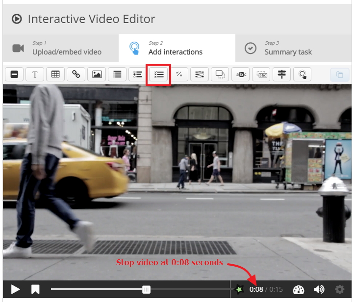
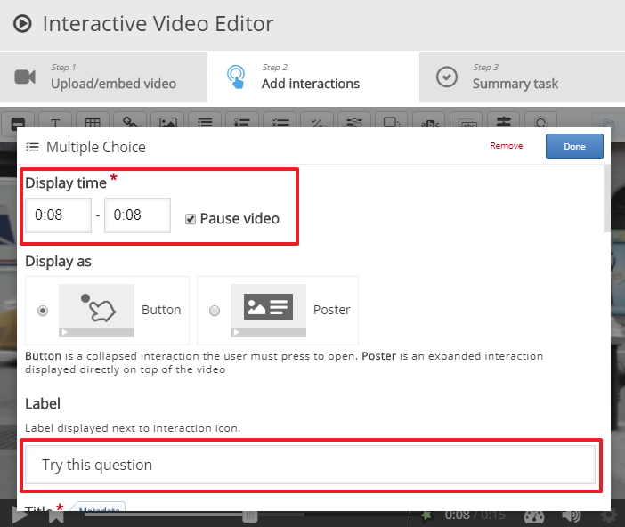
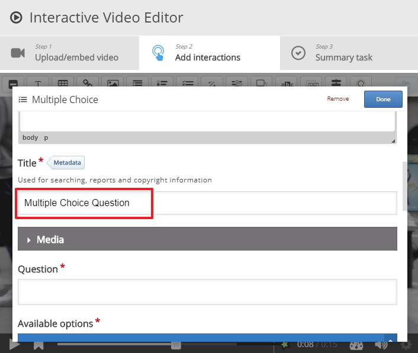
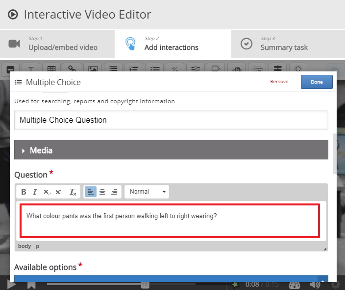
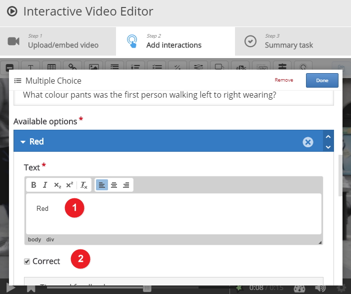
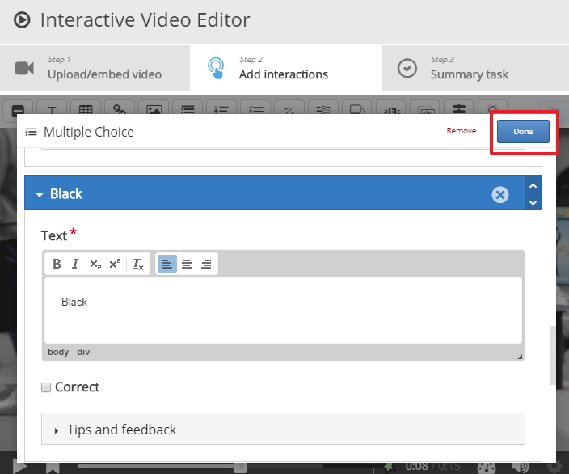
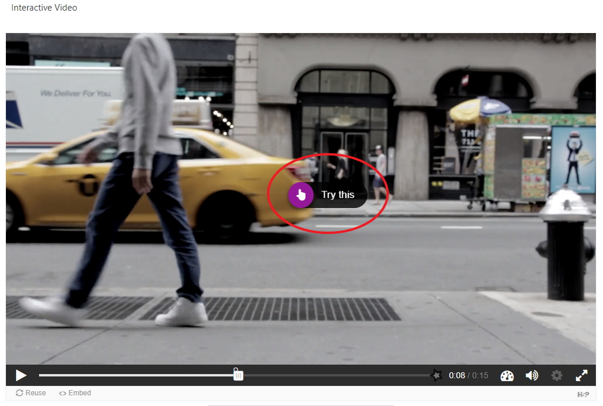

# Lets add some interactions

## Video
I am going to use <a href="https://www.pexels.com" target="_blank">this </a>video for ths example.

## Observations

In this video I will base my interactions on observations, so I will ask the student questions like 

1. How may cars pass in the video?
2. How many of the cars were taxi's?
3. What colour pants was the first person walking left to right wearing?

## 1st observation

My first observation takes place at 0:08 seconds, so stop the video at that time and select the multiple choice question type, also make sure you select 0:08 as the end time as well because if you dont the Tri this question label will remain in place until the end of the video.

## Label

Give the observation a label, at this stage we must pause the video so that the student has to try the question.

## Title

Give the observation a title

## Question

Fill in the question, I used "What colour pants was the first person walking left to right wearing?"

## Options

Fill in as many options as you like, these are the potential answers the student has to choose from in the multiple choice, I have started the first option with **Red** and I have indicated that is the correct answer, I can add other Option such **Blank** and **Blue**

## Save your changes

Make sure you save your changes now and test that everything works as expected, this is how the activity behalves, when the video is launched and we hit play at 0:08 seconds the video will stop and we are presented with the label we created earlier called **Try this** 

When the user plays the video from the Moodle screen they will see the following

When the student click on try this they are presented with the multiple choice question, they select there choice and check the results 

## Next

Move to the next step

