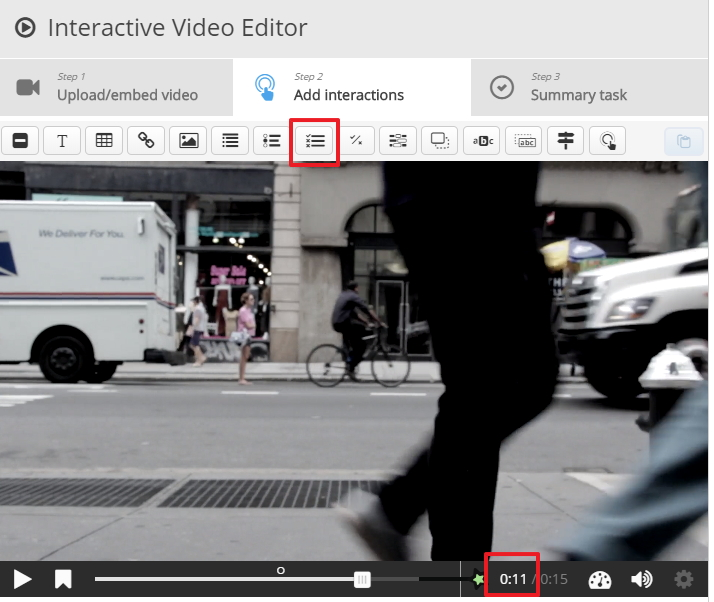
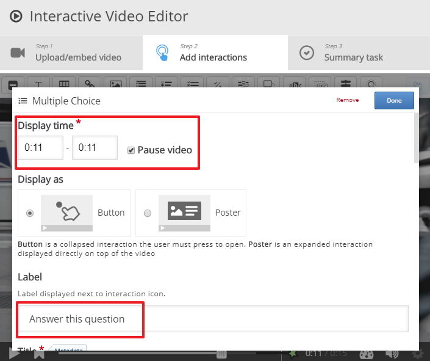
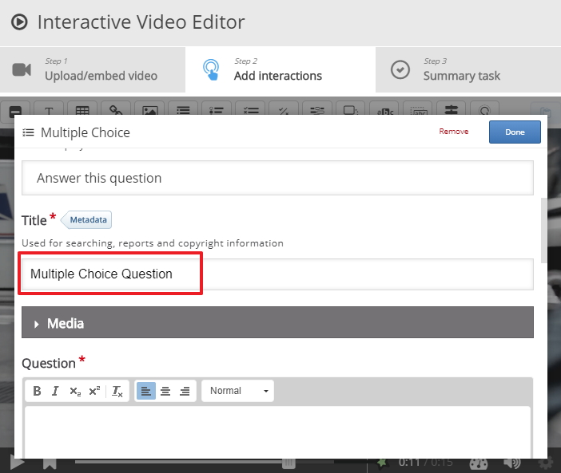
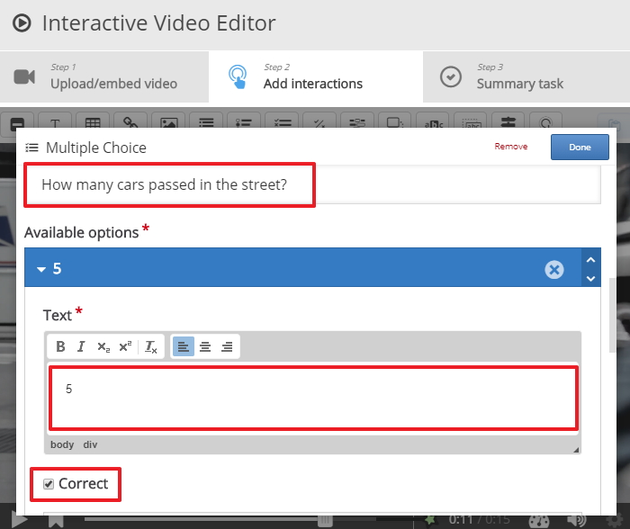
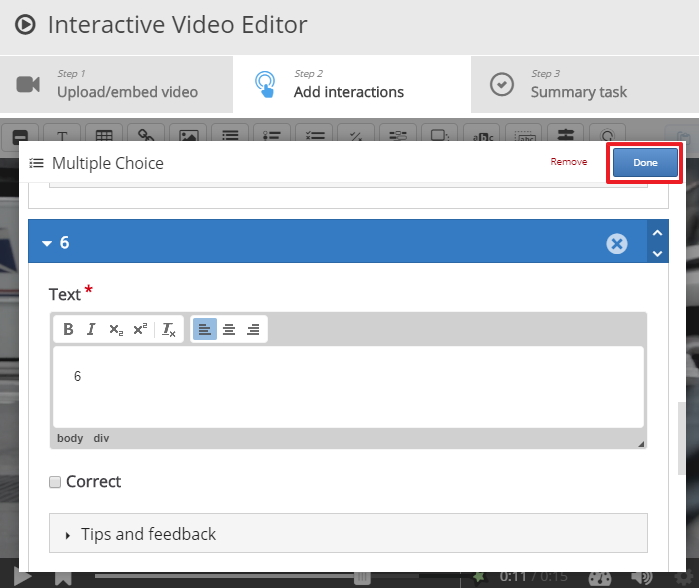
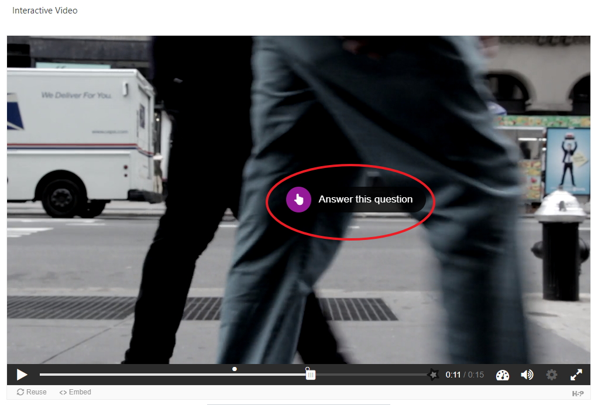
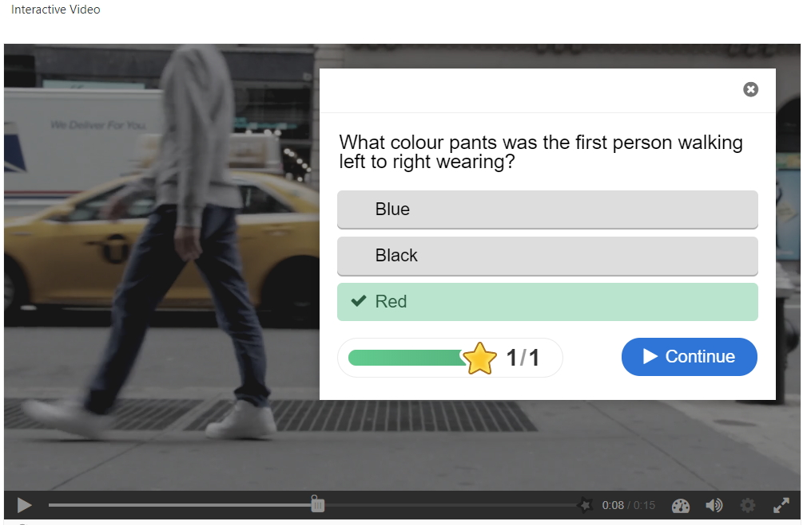

# Add more interactions

## Observations

If you recall in the last step we were using this video for observations and we include a multiple choice question asking the students **What colour pants was the first person walking left to right wearing?**, Now we can add in tye further observations.

1. How may cars pass in the street?
2. How many of the cars were taxi's?

## Next observation

My first observation takes place at 0:08 seconds, this observation will take place at 0:11 seconds 

## Label

Give the observation a label, at this stage we must pause the video so that the student has to try the question.

## Title

Give the observation a title, "How may cars pass in the street?"

## Question and Options

Fill in the question, I used "How may cars pass in the street?" and I also included the potential answers, I have started the first option with **5** and I have indicated that is the correct answer, I can add other Option such **4** and **6**

## Save your changes

Make sure you save your changes (save and display) now and test that everything works as expected, this is how the activity behalves, when the video is launched and we hit play at 0:08 seconds the video will stop and we are presented with the label we created earlier called **Try this** 

When the user plays the video from the Moodle screen, after reached 0:11 seconds they will see the following

When the student click on try this they are presented with the multiple choice question, they select there choice and check the results 

## Next

Move to the exercises

