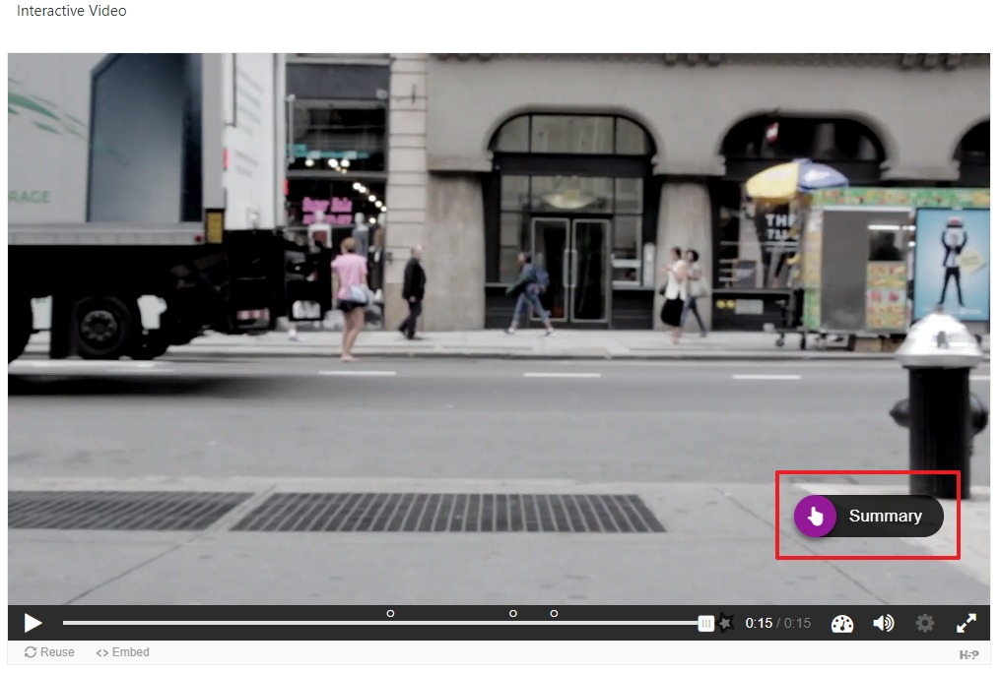
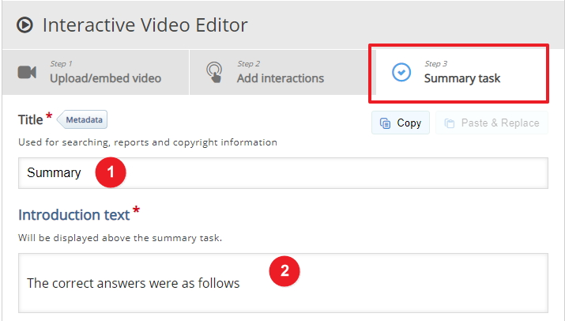

# Adding a Summary

## Summary screen

The summary will appear just before the video finishes and will give the student a summary of what the questions were and what the correct answers were.

## Add a title

Make sure you are in edit mode in the video component and goto step 3 on the screen called **Summary task** and enter a title followed by some description of the summary, you can use what I have on the screen if you like.

## Add a statement

Now you need to add in each statement in this case you can enter in the answer to each of your questions in the video, you can use what I have on the screen if you like.

## Next

Move to the exercises

